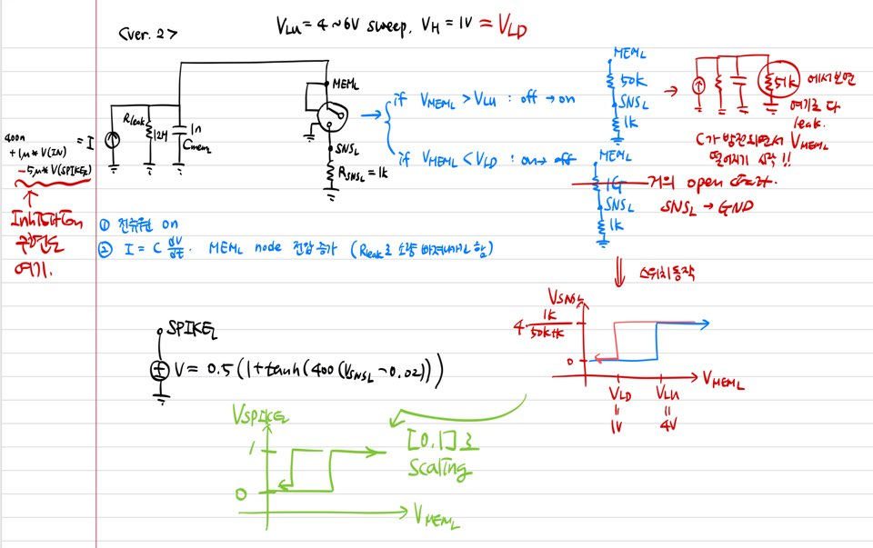

# 2026 Fall Research Plan  
## Hysteretic Push–Pull Silicon Devices for History-Dependent Vestibular Encoding

> **Target journal:** *Nano Letters* (stretch goal)  
> **Fallback:** *IEEE Transactions on Electron Devices*
---

## 1. 연구 개요

- 하나의 vestibular input을 두 반대 방향(R, L) 채널이 받음
- Right channel과 Left channel이 반대 방향으로 반응
- 두 채널이 서로 영향을 주는 push–pull / antagonistic 구조
- STL의 latch 및 hysteresis 특성을 이용
- sinusoidal input을 포함한 시간 변화 신호를 LTspice에서 처리
- **출력을 단순 waveform reproduction으로 해석하는 것이 아니라, hysteresis에 의해 이전 방향이 유지되는 stateful encoding으로 해석**한다.
즉,
$$
\text{Current output} = F\\left(\text{current input},\ \text{previous device state}\right)
$$
를 device physics 자체에서 구현하자.

---

## 2. LTspice 구조

### version 2


### 새로 강조하는 것

여기에 hysteresis를 이용한 state retention을 추가한다.

---

## 3. research question

> **Can intrinsic hysteresis in antagonistically coupled silicon devices provide history-dependent vestibular encoding without an explicit digital memory element?**

---

## 4. novelty

### 4.1 Hysteresis window를 computational parameter로 사용

STL에서 hysteresis window

$$
\Delta V_H = V_{\mathrm{LU}}-V_{\mathrm{LD}}
$$

이 연구에서는 $\Delta V_H$를 단순 device parameter가 아니라,

> **이전 directional state를 뒤집기 위해 필요한 반대 방향 stimulus의 크기**

로 해석

### 4.2 Push–pull 구조에 intrinsic memory 추가

### 4.3 Same input, different history

마지막 순간의 입력은 같아도, 원래 상태가 다르면 다른 결과가 나오는 것을 보여야 한다.

---

## 5. 할거: Measurement / TCAD / LTspice

### Measurement

실제 device에서 확보할 것:

- $V_{\mathrm{LU}}$
- $V_{\mathrm{LD}}$
- hysteresis window
- 반복성
- transient state retention
- 가능하면 input/current dependence
- 가능하면 two-device experimental coupling

### TCAD

TCAD의 역할은 **왜 latch가 발생하는지 + window를 어떻게 조절할 수 있는지**를 설명

주요 분석:

- impact ionization
- hole accumulation
- body potential
- energy band / barrier modulation
- electric field
- latch-up / latch-down 내부 상태 비교
- gate bias, geometry, BOX/body condition 등에 따른 $V_{\mathrm{LU}}$, $V_{\mathrm{LD}}$ 변화
- (가능하다면) double latch로 확장 할 때에 필요한 정보들

### LTspice

push–pull architecture 만들기

---

# 6. Main Figure Plan

## Figure 1. Concept and Existing Push–Pull Architecture

논문의 전체 아이디어와 LTspice에서 구현한 구조의 대략적인 그림

### Fig. 1a — Biological inspiration

간단한 bilateral vestibular schematic.

포함할 것:

- head rotation
- Right vestibular pathway
- Left vestibular pathway
- 한 방향의 rotation에서 한쪽 activity 증가 / 반대쪽 감소
- “push–pull organization”만 강조
- 생물학적인 근거를 추가하는 부분

### Fig. 1b — Single-device hysteresis

실제 STL characteristic에서

- $V_{\mathrm{LU}}$
- $V_{\mathrm{LD}}$
- ON/LRS state
- OFF/HRS state
- $\Delta V_H$

를 나타내주는 그림

### Fig. 1c — LTspice architecture
- 좀 간단한 버전? 수준? 에서
- 아니면 알고리즘 회로도로 표현하는게 나으면 그렇게

### Fig. 1d — Proposed operating principle

- 단순한 waveform 예시를 들면서 그에 맞는 state 를 그림.
- 그 디시에서 배운 pulse waveform 그거 그리기.
- operation rule 이해하기 위한 예시용

---

## Figure 2. Experimental Hysteresis and State Retention

### 목적

push–pull system의 memory가 일단 회로에는 가상의 device로 넣어지겠지만,
single device에 대해서는 실제로 있는 property라는 것을 증명하기 위한 부분.

### Fig. 2a — Device structure

- 측정하기 전에 어떻게 생겼는지
- SEM/TEM 사진 가능할까
- 시냅스는 안쓰고 뉴런만 쓰는거임

### Fig. 2b — latch up 원리 (EBD)
- EBD로 latch up 어떻게 되는지

### Fig. 2c — latch up 될때 4가지 단계
### Fig. 2d — IDVD 그래프에서 hysteresis 관찰

### Fig. 2e — 일정한 전류를 넣어줬을 때 output voltage oscillation

### Fig. 2f — retention / endurance

- 여러 cycle 또는 여러 device에서 hysteresis를 비교한다.
- 시간이 오래 지난 후를 비교한다. (trapping이후?)

---

## Figure 3. Device Physics and Hysteresis Engineering by TCAD

### 목적

hysteresis window 조절시 어떻게 해야되는지 device 잘라서 그 원리 보여주기 -- 근데 이 과정이 꼭 필요할까? window를 조절하기 위해 어떻게 해야 하는지 말로 설명만 하면 안되나

### Fig. 3a — latch up/down mechanism

- impact ionization rate
- hole concentration
- body potential
- EBD
등을 사용해서ㅠmechanism 설명한다.

### Fig. 3b — Threshold controllability
어떻게 해야
$$
V_{\mathrm{LU}},\qquad V_{\mathrm{LD}}
$$
변하는지.

---

## Figure 4. Push–Pull Dynamics and History-Dependent Circuit using LTSpice


### Fig. 4a — Full LTspice circuit


### Fig. 4b — 아날로그 혹은 디지털 output
- R / L에 따라 어떻게 state가 바뀌는지 기본적인 output


### Fig. 4c — Strong / weak reversal sequence
- 세기에 따라서 window 반영되면서 state 바뀌는 것을 표현

---

## Figure 5. Rotational sensory TENG and circuit

### 목적

Fig. 4에서의 입력을 **실제 motion-like input**으로 해봄

### Fig. 5a — Motion input
- TENG 원리 설명

### Fig. 5b — Push–pull channel outputs
- TENG 입력을 썼을때 어떻게 되는지

### Fig. 5c — Noise / small-motion rejection

zero 근처에서 noise를 추가한다.

비교:

**memoryless threshold**

```text
R ↔ L ↔ R ↔ L
```

**hysteretic push–pull**

```text
R → R → R → R
```

처럼 false state transition이 감소하는지를 보여준다.


### Table. 1

아래 항목들 등등을 다른 논문과 비교하는 표

- false direction-transition rate
- minimum effective reversal amplitude
- reversal detection accuracy
- switching latency
- noise tolerance
- energy per transition

---

# 7. Double-Latch
- 이건 일단 보류

가능한 extension:

```text
Strong Left
Weak Left
Neutral
Weak Right
Strong Right
```

즉 ternary directional state(left / neutral / right)를 **Quinary directional state**로 확장

---

# 8. Supporting Information - by ChatGPT
- Figure S1. Detailed device structure / fabrication
- Figure S2. Additional latch sweeps
- Figure S3. Sweep-rate dependence
- Figure S4. Device-to-device variation
- Figure S5. Repeated switching / endurance
- Figure S6. Temperature dependence
- Figure S7. TCAD mesh and model parameters
- Figure S8. Additional carrier / field distributions
- Figure S9. Additional $V_{\mathrm{LU}}$ / $V_{\mathrm{LD}}$ parameter sweeps
- Figure S10. LTspice device model
- Figure S11. Coupling-strength dependence
- Figure S12. Additional history sequences
- Figure S13. Additional noisy motion inputs
- Figure S14. Double-latch multilevel extension

---
# 9. 한문장으로
> **Two antagonistically coupled hysteretic silicon devices retain the previous directional state and reverse only when the opposing stimulus exceeds a device-defined threshold, enabling history-dependent vestibular encoding without explicit digital memory.**
